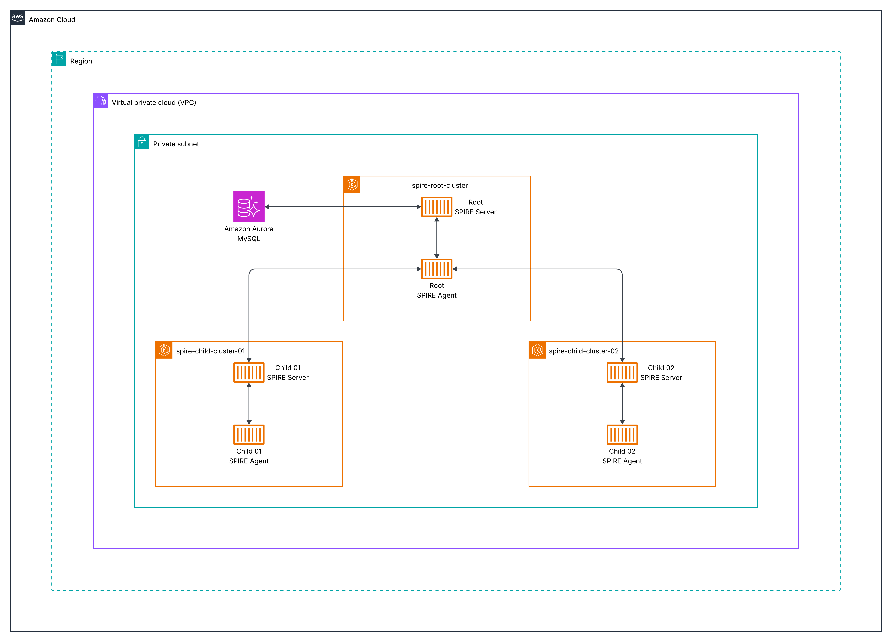

# Implement service-to-service authorization using SPIFFE/SPIRE on Amazon EKS

## Table of Contents

- [Introduction](#introduction)
- [Understanding SPIFFE/SPIRE and Service-to-Service Authorization](#understanding-spiffespire-and-service-to-service-authorization)
- [Prerequisites and Environment Setup](#prerequisites-and-environment-setup)
- [Deploying Amazon EKS Infrastructure with Terraform](#deploying-amazon-eks-infrastructure-with-terraform)
- [Installing SPIRE Server on EKS](#installing-spire-server-on-eks)
- [Deploy Envoy Test Application](#deploy-envoy-test-application)
- [Best Practices and Security Considerations](#best-practices-and-security-considerations)
- [Cleanup](#cleanup)
- [Cost Considerations](#cost-considerations)
- [Conclusion](#conclusion)

## Introduction

When running distributed applications across multiple [Amazon Elastic Kubernetes Service (Amazon EKS)](https://aws.amazon.com/eks/) clusters, teams face two critical security challenges: establishing secure communication in untrusted networks and authenticating workloads without relying on network-based controls.

**The mTLS Challenge**: Traditional approaches rely on network security to determine message sender identity and ensure message integrity. However, in complex distributed applications spanning multiple networks with services deployed by different teams, network-based protection becomes insufficient. Teams need mutual Transport Layer Security (mTLS) to cryptographically prove sender and recipient identity while ensuring messages haven't been viewed or modified in transit.

**The Authentication Challenge**: While mTLS secures channels between specific workloads, teams also need flexible authentication for scenarios where direct mTLS isn't possible—such as when Layer 7 load balancers sit between services, or when multiple workloads send messages over a single encrypted channel. JSON Web Tokens (JWTs) provide this flexibility but require proper key management and validation.

SPIFFE (Secure Production Identity Framework for Everyone) and its reference implementation SPIRE (SPIFFE Runtime Environment) solve both challenges by:

- **Attesting workload identity** at runtime in distributed systems
- **Delivering short-lived, automatically rotated X.509 certificates** (X.509-SVIDs) for mTLS directly to workloads
- **Generating and validating JWT-SVIDs** for flexible authentication scenarios
- **Eliminating manual certificate management** through the SPIFFE Workload API

This guide demonstrates deploying SPIRE in a nested configuration across multiple Amazon EKS clusters, enabling secure workload identity and authentication in distributed environments.

In this post, we show you how to implement SPIFFE/SPIRE on Amazon EKS to establish secure service-to-service communication using a nested architecture. You'll learn how to deploy SPIRE across multiple Amazon EKS clusters, configure workload attestation, and implement fine-grained authorization policies that scale with your infrastructure.

## Understanding SPIFFE/SPIRE and Service-to-Service Authorization

Before diving into the implementation, let's establish the foundational concepts of SPIFFE and SPIRE, and understand why they're essential for modern service-to-service authorization.

### What is SPIFFE?

[SPIFFE](https://spiffe.io/docs/latest/spiffe-about/overview/) is a set of open-source standards for securely identifying software systems in dynamic, heterogeneous environments. It provides a framework for workloads to present cryptographically verifiable identities, enabling secure communication without relying on network-level controls like firewalls or IP whitelists.

### What is SPIRE?

[SPIRE](https://spiffe.io/docs/latest/spire-about/) is the reference implementation of the SPIFFE standards. It serves as a production-ready SPIFFE Runtime Environment that manages the lifecycle of SPIFFE identities, including attestation, registration, and key rotation. SPIRE can be deployed in various modes, including nested hierarchies for complex, multi-cluster environments.

**Why implement SPIFFE/SPIRE?** In dynamic containerized environments, traditional security approaches break down:

- **IP-based security fails** when containers move between nodes and clusters
- **Shared secrets don't scale** across hundreds of microservices  
- **Manual certificate management** becomes operationally complex
- **Network perimeters blur** in multi-cloud and hybrid deployments

SPIRE solves these challenges by providing **cryptographic identity** that moves with workloads, **automatic credential rotation**, and **zero-trust authentication** that works regardless of network location.

### The Need for Service-to-Service Authorization

Traditional security models often rely on network policies or API gateways, which can be cumbersome and error-prone in microservices architectures. SPIFFE/SPIRE addresses this by:

- Providing workload identities that are cryptographically verifiable
- Enabling mutual TLS (mTLS) authentication between services
- Supporting fine-grained authorization policies based on identity
- Automating key rotation and certificate management

### What is Nested SPIRE?

Nested SPIRE is a deployment architecture that allows SPIRE Servers to be "chained" together, enabling all servers to issue identities within the same trust domain. This means workloads across different clusters receive identity documents that can be verified against the same root keys, creating a unified security boundary.

**How the Chaining Works:**

- A **SPIRE Agent is co-located** with every downstream SPIRE Server
- The downstream server **obtains credentials via the Workload API** from its local agent
- These credentials are used to **authenticate directly with the upstream SPIRE Server**
- The upstream server issues an **intermediate Certificate Authority (CA)** to the downstream server
- All servers in the chain can now **issue SVIDs within the same trust domain**

**Key Benefits:**

- **Unified Trust Domain**: All workloads across clusters share the same cryptographic root of trust
- **Multi-Cloud Ready**: Different child servers can use different node attestors for various cloud environments
- **Scalable Architecture**: New clusters can be added by chaining additional SPIRE servers
- **Centralized Root Management**: Single root server manages the trust domain while child servers handle local workloads

This architecture is particularly well-suited for multi-cloud deployments where workloads need to authenticate across different infrastructure environments while maintaining a consistent security model.

### Architecture Overview



Figure 1: Nested SPIRE architecture showing root and child servers across multiple EKS clusters

### Components

- **Root Cluster** (spire-root-cluster): Hosts the root SPIRE server
- **Child Clusters** (spire-child-cluster-01, spire-child-cluster-02): Host child SPIRE servers and workloads
- **[Amazon Aurora](https://aws.amazon.com/rds/aurora/)**: Persistent datastore for the root SPIRE server
- **Kubeconfig Generator**: Script to create secure cluster access configurations

## Node Attestation in Nested SPIRE

Before diving into the deployment process, it's crucial to understand how SPIRE establishes trust between servers and agents across clusters through **node attestation**.

### What is Node Attestation?

Node attestation is the process where each SPIRE agent authenticates and verifies itself when first connecting to a SPIRE server. During this process, the agent and server work together to verify the identity of the node the agent is running on using plugins called **node attestors**.

Node attestors interrogate a node and its environment for information that only that specific node would possess, proving the node's identity through various methods:

- **Cloud platform identity documents** (such as AWS Instance Identity Documents)
- **Hardware Security Module or TPM private keys**
- **Manual verification via join tokens**
- **Multi-node software system credentials** (such as Kubernetes Service Account tokens)
- **Deployed server certificates**

The result of successful node attestation is that the agent receives a unique **SPIFFE ID**, which serves as the "parent" identity for all workloads it manages.

### Kubernetes Node Attestation (k8s_psat)

In our Nested SPIRE deployment, we use the **[k8s_psat plugin](https://github.com/spiffe/spire/blob/main/doc/plugin_server_nodeattestor_k8s_psat.md)** for node attestation. This plugin:

1. **Validates signed projected service account tokens** provided by agents
2. **Uses the [Kubernetes Token Review API](https://kubernetes.io/docs/reference/kubernetes-api/authentication-resources/token-review-v1/)** to perform validation
3. **Queries the Kubernetes API server** for additional node metadata (UID, namespace, service account)
4. **Generates SPIFFE IDs** based on the validated node information

### Why Cross-Cluster Access is Required

In a nested architecture, the **root SPIRE server must validate tokens from child cluster nodes**. This is why our deployment process includes:

1. **Kubeconfig generation script** - Creates secure access credentials for each child cluster
2. **Base64-encoded kubeconfig injection** - Provides the root server with child cluster API access:

   ```bash
   --set "external-spire-server.kubeConfigs.child01.kubeConfigBase64=$(cat ../script/spire-child-cluster-01.kubeconfig)"
   ```

This cross-cluster access enables the root server to perform Kubernetes Token Review API calls against child clusters, validating that agents requesting intermediate CA certificates are legitimate nodes within the trusted infrastructure.

## Prerequisites and Environment Setup

Before deploying SPIFFE/SPIRE on Amazon EKS, verify you have the following prerequisites:

### Required Tools and Software

- **AWS CLI**: Version 2.x, configured with appropriate credentials and permissions
- **Terraform**: Version 1.0 or later for infrastructure provisioning
- **kubectl**: Latest stable version for Kubernetes cluster management
- **Helm**: Version 3.8 or later for package management
- **kubectx** (optional): For easier cluster context switching

### AWS Account Requirements

You'll need an AWS account with permissions to:

- Create EKS clusters
- Manage VPCs and subnets
- Deploy IAM roles and policies

### Infrastructure Components

Our Nested SPIRE deployment consists of several key AWS infrastructure components that work together to provide secure workload identity across multiple clusters.

#### 1. EKS Clusters

The deployment consists of three EKS clusters:

| Cluster | Purpose | Terraform Path | Region | Node Groups |
|---------|---------|----------------|--------|-------------|
| **spire-root-cluster** | Hosts the root SPIRE server | `infrastructure/eks/spire-root-cluster/` | us-east-1 | Optimized for SPIRE server workloads |
| **spire-child-cluster-01** | Hosts child SPIRE server and application workloads | `infrastructure/eks/spire-child-cluster-01/` | us-east-1 | Mixed instance types for diverse workloads |
| **spire-child-cluster-02** | Hosts child SPIRE server and application workloads | `infrastructure/eks/spire-child-cluster-02/` | us-east-1 | Mixed instance types for diverse workloads |

#### 2. Amazon Aurora MySQL Datastore (`infrastructure/rds/spire-datastore/`)

The root SPIRE server requires persistent storage for audit logs, registration entries, node attestation data, and certificate authority information.

**Configuration:**

- **Engine**: MySQL 8.0
- **Instance Class**: Serverless v2 (auto-scaling)
- **Storage**: Encrypted with AWS KMS
- **Backup**: Automated daily backups
- **Multi-AZ**: Enabled for high availability

#### 3. Networking Architecture

Each cluster is deployed in its own or shared VPC with:

- **Public Subnets**: For load balancers and NAT gateways
- **Private Subnets**: For EKS nodes and Amazon Aurora instances
- **Security Groups**: Restrictive rules for inter-cluster communication
- **VPC Peering**: Enables secure communication between clusters

### Environment Variables

Set the following environment variables:

```bash
export AWS_REGION=your-aws-region # e.g., us-east-1
export CLUSTER_NAME_ROOT=your-root-cluster-name # e.g., spire-root-cluster
export CLUSTER_NAME_CHILD1=your-child-cluster-1-name # e.g., spire-child-cluster-01
export CLUSTER_NAME_CHILD2=your-child-cluster-2-name # e.g., spire-child-cluster-02
```

## Deploying Amazon EKS Infrastructure with Terraform

Now that we understand the architecture and components, let's deploy the AWS infrastructure using Terraform to create our Nested SPIRE environment.

### Infrastructure Overview

We'll deploy three EKS clusters: a root cluster for the SPIRE trust anchor and two child clusters for workload deployment.

### Deployment Steps

Follow these steps to deploy the infrastructure components, starting with networking, then the database, and finally the EKS clusters.

#### 1. Obtain Networking Values

Before deploying the SPIRE infrastructure, you'll need to gather the following networking values from your existing VPC setup:

- VPC ID
- Private subnets (list)
- Public subnets (list)
- VPC CIDR block
- Route 53 DNS zone (for external-dns to create SPIRE server domain pointing to ALB)

These values will be required for the database and EKS cluster `variables.tf` files in the subsequent deployment steps.

#### 2. Deploy Aurora MySQL

Update the `variables.tf` file with the networking values from the previous step.

```bash
cd infrastructure/rds/spire-datastore/
terraform init
terraform plan
terraform apply
```

After deployment, retrieve the database endpoint and secrets ARN that will be used in subsequent configurations:

```bash
terraform output aurora_mysql_v2_cluster_endpoint
terraform output aurora_mysql_v2_cluster_master_user_secret_arn
```

Save these values as they will be required for the root EKS cluster and `root-values.yaml` configuration in the SPIRE installation steps.

#### 3. Deploy Root EKS Cluster

Update the `variables.tf` file with the networking values from step 1, the database values from step 2, your Route 53 DNS zone, and RDS cluster ARN.

```bash
cd ../../eks/spire-root-cluster/
terraform init
terraform plan
terraform apply
```

After deployment, retrieve the IAM role ARNs that will be needed for the child cluster configurations:

```bash
terraform output cluster_iam_role_arn
terraform output node_iam_role_arn
terraform output spire_server_service_account_role_arn
```

Save these ARN values as they will be required for the child cluster `variables.tf` files.

#### 4. Deploy Child Cluster 01

Update the `variables.tf` file with the networking values from step 1, the database values from step 2, and the IAM role ARNs from step 3.

```bash
cd ../spire-child-cluster-01/
terraform init
terraform plan
terraform apply
```

#### 5. Deploy Child Cluster 02

Update the `variables.tf` file with the networking values from step 1, the database values from step 2, and the IAM role ARNs from step 3.

```bash
cd ../spire-child-cluster-02/
terraform init
terraform plan
terraform apply
```

#### 6. Setup Kubeconfigs Locally

Update your kubeconfig files for all three clusters:

```bash
aws eks --region us-east-1 update-kubeconfig --name spire-root-cluster
aws eks --region us-east-1 update-kubeconfig --name spire-child-cluster-01
aws eks --region us-east-1 update-kubeconfig --name spire-child-cluster-02
```

### 7. Run the Generate Kubeconfig Script

In the `script` directory, execute the script to generate base64-encoded kubeconfigs:

```bash
cd script
./generate_kubeconfig.sh
```

**What this script does:**

1. Creates temporary kubeconfig files for each child cluster
2. Extracts cluster certificate authority data and endpoints
3. Retrieves service account tokens from the `spire-system` namespace
4. Generates base64-encoded kubeconfig files for secure cluster access
5. Creates both encoded and decoded versions for verification

## Installing SPIRE Server on EKS

With the infrastructure deployed and kubeconfigs generated, we can now install SPIRE across our clusters using Helm charts.

### Helm Values Structure

The SPIRE deployment uses multiple Helm values files to organize configuration settings for different cluster roles and shared parameters.

#### `your-values.yaml`

Contains common configuration shared across all clusters:

- Image registry settings (for private registries)
- Resource limits and requests
- Security contexts
- Logging configuration

#### `root-values.yaml`

Specific configuration for the root SPIRE server:

- Database connection settings
- Trust domain configuration
- External cluster access settings
- Certificate authority configuration

#### `spire-child-cluster-01.yaml` and `spire-child-cluster-02.yaml`

Child-specific configurations:

- Parent server connection details
- Local cluster settings
- Node attestation configuration

### Key Configuration Parameters

**Root Server Configuration:**

```yaml
spire-server:
  dataStore:
    sql:
      databaseType: mysql
      databaseName: sharedqaspireserver
      host: "demo-serverless-mysqlv2.cluster-abc123def456.us-east-1.rds.amazonaws.com"
      port: 3306
      region: "us-east-1"
      username: spireadmin
      externalSecret:
        enabled: true
        name: spire-db-secret
        key: password

  trustDomain: "spireserver.example.com"
  
  nodeAttestor:
    k8sPSAT:
      serviceAccountAllowList:
        - "spire-mgmt:spire-agent"
        - "default:default"
```

**Child Server Configuration:**

```yaml
spire-server:
  upstreamAuthority:
    spire:
      enabled: true
      upstreamDriver: "spire-plugin"
      serverAddress: "spire-server.spire-mgmt.svc.cluster.local"
      serverPort: 8081
      
  trustDomain: "spireserver.example.com"
```

### Critical Configuration Note: Service Name Length Constraints

**IMPORTANT**: When deploying Nested SPIRE, the cluster identifiers used in Helm commands must be **7 characters or fewer**. This is due to Internet Assigned Numbers Authority (IANA) that constraints the limit of the service names to 15 characters maximum.

[RFC 6335 Section 5.1](https://www.rfc-editor.org/rfc/rfc6335.html#section-5.1):

- Valid service names are hereby normatively defined as follows:
  - MUST be at least 1 character and no more than 15 characters long

The SPIRE Helm chart appends these identifiers to service names, causing deployment failures if too long.

- Template generates: `prom-cm-{CLUSTER_ID}`  
- With `ABCDEFG-qa-01`: becomes `prom-cm-ABCDEFG-qa-01` (21 characters) ❌
- With `child01`: becomes `prom-cm-child01` (15 characters) ✅

**Example of the constraint:**

```bash
# ❌ This will FAIL - "ABCDEFG-qa-01" is too long (12 characters)
--set "external-spire-server.kubeConfigs.ABCDEFG-qa-01.kubeConfigBase64=..."

# ✅ This will WORK - "child01" is short enough (7 characters)  
--set "external-spire-server.kubeConfigs.child01.kubeConfigBase64=..."
```

The cluster identifier (e.g., `child01`) is:

- Used only for Helm configuration - it doesn't need to match the actual EKS cluster name
- Appended to service names by the Helm template
- Must comply with RFC 6335 naming constraints

### 1: Setup Root Cluster spire-root-cluster

We'll start by configuring the root cluster, which serves as the trust anchor for our Nested SPIRE deployment.

#### 1a. Use the Root Cluster Context

Switch to the root cluster context:

```bash
kubectx arn:aws:eks:us-east-1:111122223333:cluster/spire-root-cluster
```

#### 1b. Install CRDs on the Root Cluster

Navigate back to the `helm` directory and install the CRDs on the root cluster:

```bash
cd ../helm
helm upgrade --install --create-namespace -n spire-mgmt spire-crds spire-crds \
--repo https://spiffe.github.io/helm-charts-hardened/
```

#### 1c. Install the Root Server

Install the root server using the encoded kubeconfigs for child clusters:

```bash
helm upgrade --install -n spire-mgmt spire spire-nested --repo https://spiffe.github.io/helm-charts-hardened/ \
--set "external-spire-server.kubeConfigs.child01.kubeConfigBase64=$(cat ../script/spire-child-cluster-01.kubeconfig)" \
--set "external-spire-server.kubeConfigs.child02.kubeConfigBase64=$(cat ../script/spire-child-cluster-02.kubeconfig)" \
-f your-values.yaml -f root-values.yaml
```

**Command Explanation:**

- `child01` and `child02` are short identifiers (≤7 chars) to avoid service name length issues
- These identifiers are used internally by Helm and don't need to match cluster names
- The actual cluster access is provided by the base64-encoded kubeconfig files
- Each `kubeConfigBase64` parameter contains the complete authentication information for accessing the respective child cluster

### 2. Setup Child Cluster spire-child-cluster-01

Now we'll configure the first child cluster, which will connect to the root server to obtain its intermediate CA certificate.

#### 2a. Switch to spire-child-cluster-01 Cluster

Switch to the `spire-child-cluster-01` cluster context:

```bash
kubectx arn:aws:eks:us-east-1:111122223333:cluster/spire-child-cluster-01
```

#### 2b. Mark spire-system namespace as Helm-managed for the spire release

```bash
kubectl label namespace spire-system app.kubernetes.io/managed-by=Helm --overwrite && kubectl annotate namespace spire-system meta.helm.sh/release-name=spire meta.helm.sh/release-namespace=spire-mgmt --overwrite
```

#### 2c. Install CRDs and Server for spire-child-cluster-01

Install the CRDs and server for `spire-child-cluster-01`:

```bash
helm upgrade --install --create-namespace -n spire-mgmt spire-crds spire-crds \
--repo https://spiffe.github.io/helm-charts-hardened/
helm upgrade --install -n spire-mgmt spire spire-nested --repo https://spiffe.github.io/helm-charts-hardened/ \
-f your-values.yaml -f spire-child-cluster-01.yaml
```

### 3. Setup Child Cluster spire-child-cluster-02

Next, we'll configure the second child cluster using the same process as the first child cluster.

#### 3a. Switch to spire-child-cluster-02 Cluster

Switch to the `spire-child-cluster-02` cluster context:

```bash
kubectx arn:aws:eks:us-east-1:111122223333:cluster/spire-child-cluster-02
```

#### 3b. Mark spire-system namespace as Helm-managed for the spire release

```bash
kubectl label namespace spire-system app.kubernetes.io/managed-by=Helm --overwrite && kubectl annotate namespace spire-system meta.helm.sh/release-name=spire meta.helm.sh/release-namespace=spire-mgmt --overwrite
```

#### 3c. Install CRDs and Server for spire-child-cluster-02

Install the CRDs and server for `spire-child-cluster-02` using the specific child values file:

```bash
helm upgrade --install --create-namespace -n spire-mgmt spire-crds spire-crds \
--repo https://spiffe.github.io/helm-charts-hardened/
helm upgrade --install -n spire-mgmt spire spire-nested --repo https://spiffe.github.io/helm-charts-hardened/ \
-f your-values.yaml -f spire-child-cluster-02.yaml
```

## Deploy Envoy Test Application

With SPIRE installed across all clusters, we'll now deploy a test application to demonstrate secure service-to-service communication using SPIFFE identities.

### 1. Switch to spire-child-cluster-01

Ensure you're connected to the child cluster:

```bash
kubectx arn:aws:eks:us-east-1:111122223333:cluster/spire-child-cluster-01
```

### 2. Update SPIFFE Trust Domain in ConfigMaps

Before deploying, update the trust domain in each `configmap.yaml` file under the `envoy/` directory to match your root cluster's trust domain.

For example, change:

```yaml
- name: "spiffe://spirenested.example.com/ns/ecommerce/sa/edge-proxy-service-account"
```

The domain must match the `trustDomain` value in `helm/root-values.yaml`:

```yaml
trustDomain: spirenested.example.com
```

### 3. Create Namespace and Deploy

Create the ecommerce namespace and deploy the application:

```bash
kubectl create ns ecommerce
kubectl apply -R -f envoy/
```

### 4. Get Network Load Balancer DNS

Wait for the NLB to provision, then retrieve its DNS:

```bash
kubectl get svc -n ecommerce edge-proxy -o jsonpath='{.status.loadBalancer.ingress[0].hostname}'
```

### 5. Test the Application

Access the GraphQL endpoint using the NLB DNS:

```text
http://<NLB-DNS>:8081/v1/graphql
```

Example:

```text
http://k8s-ecommerc-edgeprox-a1b2c3d4e5-f6g7h8i9j0k1l2m3.elb.us-east-1.amazonaws.com:8081/v1/graphql
```

Run this query to verify the deployment:

```graphql
query {
  orders {
    id
    orderFor
    product {
      id
      name
    }
  },
  products {
    id
    name
  }
}
```

You should see data for orders and products returned successfully.

### 6. Introduce a SPIFFE ID Mismatch

Edit `envoy/graphql/configmap.yaml` line 182 and change the SPIFFE ID from plural to singular:

```yaml
exact: "spiffe://spirenested.example.com/ns/ecommerce/sa/order-service-account"
```

Apply the change and restart the deployment:

```bash
kubectl apply -f envoy/graphql/configmap.yaml
kubectl rollout restart deployment graphql -n ecommerce
```

### 7. Observe the Error

Run the same GraphQL query. You'll see an error for orders:

```json
{
  "errors": [
    {
      "message": "Request failed with status code 503",
      "locations": [
        {
          "line": 2,
          "column": 3
        }
      ],
      "path": [
        "orders"
      ]
    }
  ]
}
```

This occurs because the SPIFFE ID no longer matches the orders service.

### 8. Fix the Issue

Revert the change back to the correct SPIFFE ID:

```yaml
exact: "spiffe://spirenested.example.com/ns/ecommerce/sa/orders-service-account"
```

Apply and restart:

```bash
kubectl apply -f envoy/graphql/configmap.yaml
kubectl rollout restart deployment graphql -n ecommerce
```

The query should now work correctly again.

### Common Issues and Solutions

#### 1. Service Name Length Constraints

**Problem**: Helm template generates service names exceeding 15 characters (RFC 6335 limit)
**Error**: `must be no more than 15 characters`

**Root Cause**: The SPIRE Helm chart appends cluster identifiers to service names. For example:

- Template generates: `prom-cm-{CLUSTER_ID}`  
- With `ABCDEFG-qa-01`: becomes `prom-cm-ABCDEFG-qa-01` (21 characters) ❌
- With `child01`: becomes `prom-cm-child01` (15 characters) ✅

**Solution**: Use cluster identifiers of 7 characters or fewer:

```bash
# ❌ Too long - will cause deployment failure
--set "external-spire-server.kubeConfigs.routing-qa-01.kubeConfigBase64=..."

# ✅ Correct - short identifier
--set "external-spire-server.kubeConfigs.child01.kubeConfigBase64=..."
```

**Important**: The cluster identifier is only used for Helm templating and doesn't need to match the actual EKS cluster name.

#### 2. Image Registry Issues

**Problem**: Cannot pull images from public registries
**Solution**: Configure private registry in `your-values.yaml`:

```yaml
global:
  spire:
    image:
      registry: "your-private-registry.com"
```

#### 3. Storage Class Issues

**Problem**: `pod has unbound immediate PersistentVolumeClaims`
**Solution**: Ensure default storage class is configured:

```bash
kubectl patch storageclass gp2 -p '{"metadata": {"annotations":{"storageclass.kubernetes.io/is-default-class":"true"}}}'
```

#### 4. IP Exhaustion

**Problem**: Not enough IP addresses in VPC CIDR
**Solution**:

- Use larger CIDR blocks for VPCs
- Implement IP address management (IPAM)
- Consider using AWS VPC CNI with prefix delegation

#### 5. IMDSv2 Compatibility Issue

SPIRE does not currently support IMDSv2 when strictly enforced. The Terraform configuration sets `http_tokens = "optional"` to allow both IMDSv1 and IMDSv2:

```hcl
eks_managed_node_groups = {
  general-instances = {
    ...
    metadata_options = {
      http_endpoint = "enabled"
      http_tokens   = "optional"
    }
  }
}
```

For more details, see: [IMDSv2 Requirement Breaks aws_mysql and aws_postgres Authentication](https://github.com/spiffe/spire/issues/6118)

### Verification Commands

Check SPIRE server status:

```bash
kubectl exec -n spire-mgmt spire-server-0 -- /opt/spire/bin/spire-server healthcheck
```

List registration entries:

```bash
kubectl exec -n spire-mgmt spire-server-0 -- /opt/spire/bin/spire-server entry show
```

Check agent status:

```bash
kubectl exec -n spire-mgmt daemonset/spire-agent -- /opt/spire/bin/spire-agent healthcheck
```

### Troubleshooting Commands

Check SPIRE server logs:

```bash
kubectl logs -n spire-system deployment/spire-server
```

Verify agent connectivity:

```bash
kubectl exec -it spire-agent-pod -- spire-agent api fetch
```

Test mTLS communication:

```bash
openssl s_client -connect my-service:8443 -cert /path/to/cert.pem -key /path/to/key.pem
```

## Best Practices and Security Considerations

### 1. Infrastructure Management

- Use Infrastructure as Code (Terraform) for reproducible deployments
- Implement proper tagging strategies for resource management
- Use separate AWS accounts for different environments

### 2. Security

- Rotate certificates regularly
- Implement comprehensive monitoring and alerting
- Use AWS IAM roles for service accounts (IRSA)
- Enable AWS CloudTrail for audit logging

### 3. Operations

- Implement automated backup strategies for Amazon Aurora
- Use GitOps for configuration management
- Implement proper CI/CD pipelines for updates
- Monitor resource utilization and costs

### 4. Scalability

- Plan for cluster growth and additional child clusters
- Implement horizontal pod autoscaling
- Use cluster autoscaling for dynamic node management
- Consider multi-region deployments for disaster recovery

### 5. Additional Security Considerations

- **Network Policies**: Implement Kubernetes network policies to restrict traffic
- **RBAC**: Use least-privilege service accounts
- **Secrets Management**: Store sensitive data in AWS Secrets Manager
- **Encryption**: Enable encryption at rest and in transit
- **Audit Logging**: Enable comprehensive audit logging

## Cleanup

To tear down the infrastructure, run terraform destroy in reverse order:

### 1. Destroy Child Cluster 02

```bash
cd infrastructure/eks/spire-child-cluster-02/
terraform destroy
```

### 2. Destroy Child Cluster 01

```bash
cd ../spire-child-cluster-01/
terraform destroy
```

### 3. Destroy Root EKS Cluster

```bash
cd ../spire-root-cluster/
terraform destroy
```

### 4. Destroy Aurora MySQL

```bash
cd ../../rds/spire-datastore/
terraform destroy
```

## Cost Considerations

- EKS clusters: Pricing based on instance types and usage
- Amazon Aurora MySQL: Serverless v2 pricing based on compute and storage
- Data transfer: Costs for inter-cluster communication

This blog post is based on Nested SPIRE deployment patterns and AWS EKS infrastructure. Always refer to the latest SPIRE documentation and AWS best practices for the most current deployment guidance.

## Conclusion

This Nested SPIRE deployment provides a robust foundation for secure workload identity management across multiple Kubernetes clusters. The architecture scales well and provides the flexibility needed for complex microservices environments while maintaining strong security postures.

By following this post, you've learned how to deploy SPIRE in a nested configuration on Amazon EKS, configure workload attestation and identity management, implement service-to-service authorization policies, monitor and troubleshoot your SPIFFE/SPIRE deployment, and apply best practices for production deployments.

The combination of AWS managed services (Amazon EKS, Amazon Aurora) with the Nested SPIRE architecture creates a production-ready identity infrastructure that can support enterprise-scale applications with stringent security requirements.

As cloud-native architecture continues to evolve, SPIFFE/SPIRE will play an increasingly important role in securing distributed systems. Consider exploring integrations with service meshes like Istio and monitoring tools like Prometheus to further enhance your security posture.

For additional support and advanced configurations, refer to the [SPIRE documentation](https://spiffe.io/docs/) and the [Helm charts repository](https://github.com/spiffe/helm-charts-hardened).
